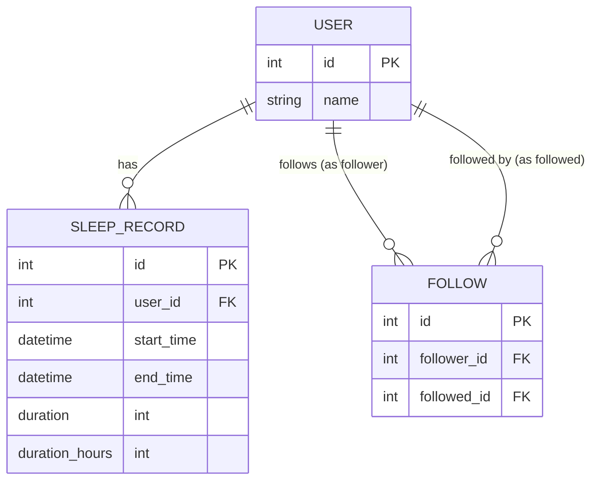

# sleep-tracker-rails

Simple sleep tracking application where users can log their sleep records, follow/unfollow other users, and view their friends’ sleep history.
This project is built with **Ruby on Rails**.

---

## 🚀 Features

* **Clock In / Clock Out** sleep sessions
* **View all your sleep logs** in chronological order
* **Follow / Unfollow users**
* **See your friends’ weekly sleep records** (ranked by duration)

---

## 🛠 Tech Stack

* Ruby version
  * Ruby 3.2
  * Rails 7.1
* System dependencies
  * PostgreSQL
  * RSpec for testing
  * Faker for test data

---

## ⚙️ Setup

### 1. Clone repository

```bash
git clone https://github.com/aryasuryapp/sleep-tracker-rails.git
cd sleep-tracker-rails
```

### 2. Install dependencies

```bash
bundle install
```

### 3. Setup database

```bash
rails db:create db:migrate db:seed
```

### 4. Run server

```bash
rails s
```

Server will run at: `http://localhost:3000`

---

## 📖 API Endpoints

### 1. Clock In / Clock Out

* **POST** `/sleep_records/clock_in`
* **POST** `/sleep_records/clock_out`
* **GET** `/sleep_records` → List all your sleep logs (sorted by created time)

### 2. Follow / Unfollow

* **POST** `/users/:id/follow`
* **DELETE** `/users/:id/unfollow`

### 3. Friends’ Weekly Sleep Records

* **GET** `/users/:id/following/sleep_records`
  Returns all friends’ sleep records from the last week, sorted by sleep duration.

**Example Response:**

```json
[
    {
        "id": 37,
        "start_time": "2025-09-26T00:00:40.568Z",
        "end_time": "2025-09-26T09:00:40.568Z",
        "duration": 32400,
        "duration_hours": 9,
        "created_at": "2025-09-28T16:29:57.734Z",
        "updated_at": "2025-09-28T20:15:24.557Z",
        "user": {
            "id": 2,
            "name": "Bob"
        }
    },
    {
        "id": 15,
        "start_time": "2025-09-22T20:24:11.011Z",
        "end_time": "2025-09-23T05:24:11.011Z",
        "duration": 32400,
        "duration_hours": 9,
        "created_at": "2025-09-28T15:46:55.162Z",
        "updated_at": "2025-09-28T20:15:24.506Z",
        "user": {
            "id": 3,
            "name": "Charlie"
        }
    }
]
```

---

## 🧪 Running Tests

```bash
bundle exec rspec
```

---

## 🌱 Seed Data

This project includes a seed file to quickly populate the database with sample data for testing.

Run:

```bash
rails db:seed
```

The seed will create:

* 5 sample users (`Alice`, `Bob`, `Charlie`, `Diana`, `Eve`)
* Random **sleep records** for the past 7 days
* Some **follow relationships** between users

This allows you to immediately test API endpoints without manually creating users or records.

---

## 📊 ERD (Entity Relationship Diagram)



---

## 📈 Scalability Considerations

* **Indexes on foreign keys & timestamps** for efficient queries.
* **Pagination** for large datasets.
* **N+1 query prevention** using `includes`.

---

## 📜 License

MIT License

---

## 👤 Author

* Arya Surya – [GitHub](https://github.com/aryasuryapp)
